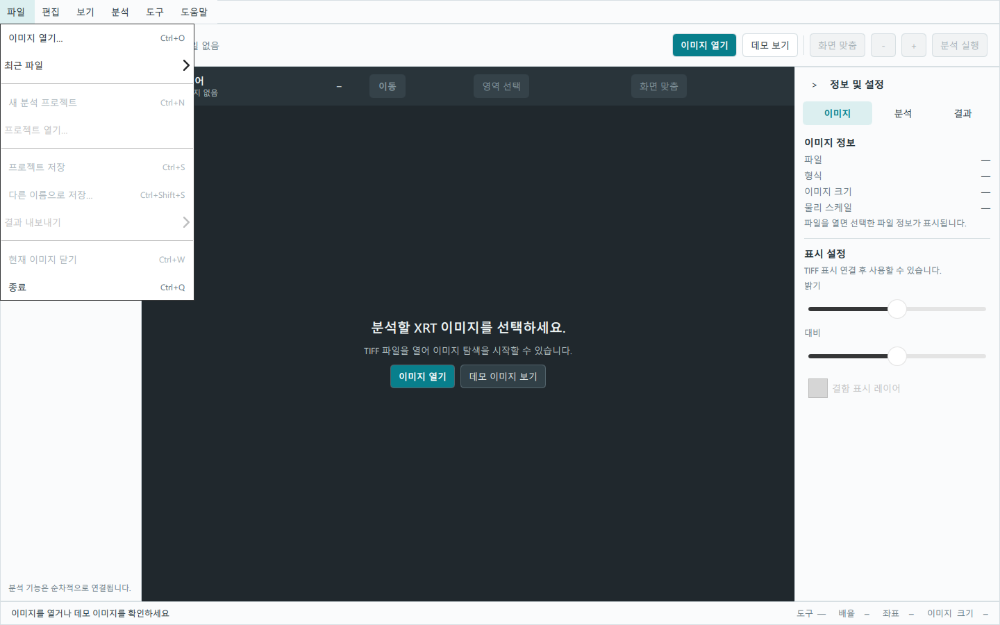
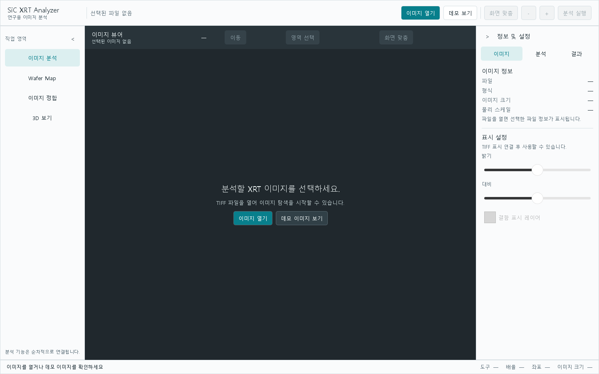
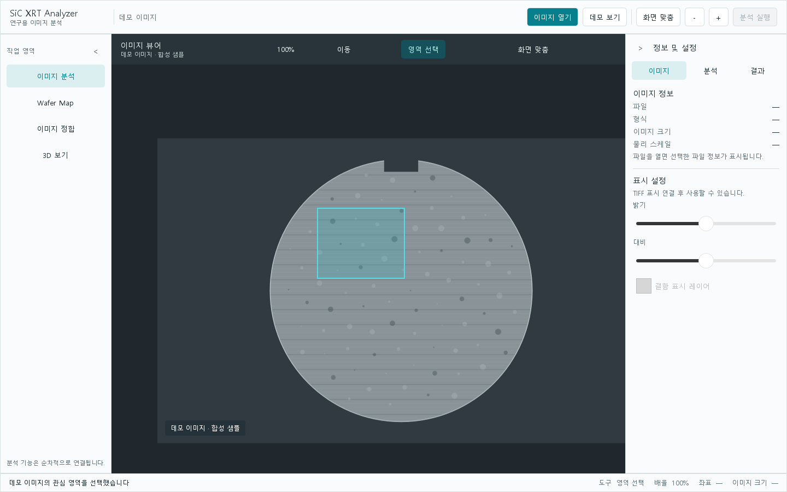

# sic-xrt-analyzer

SiC XRT 이미지의 데스크톱 분석 앱입니다. PySide6/QML UI, TIFF 로딩, 웨이퍼 맵, 이미지 정합, 3D 시각화, 승인된 ONNX 모델 추론을 이 저장소에서 다룹니다. 기능 구현은 각 GitHub Issue에서 범위를 먼저 정합니다.

## 시작

- Python 3.11 이상
- 개발 도구: `python -m pip install -e ".[dev]"`
- UI 실행: `python -m pip install -e ".[ui]"` 후 `python -m sic_xrt_analyzer`
- 검사: `ruff check .`, `pytest` (`pytest`의 UI 스모크 검사는 PySide6가 필요합니다)

## 초기 UI

`python -m sic_xrt_analyzer`로 1440×900 기본 창을 엽니다. 창은 1100×700까지 줄일 수 있고 좌우 패널을 접어 이미지 영역을 넓힐 수 있습니다. 상단 **이미지 열기** 또는 `Ctrl+O`로 TIFF 파일 선택 창을 열 수 있습니다. 취소하면 현재 파일 선택은 유지됩니다.

### 상단 메뉴

메뉴는 `파일 | 편집 | 보기 | 분석 | 도구 | 도움말` 순서이며 기존 툴바 위에 있습니다. 메뉴·툴바·단축키의 이미지 열기와 확대 조작은 같은 액션을 실행합니다. `Alt+F/E/V/A/T/H`로 각 메뉴를 열고 방향키로 이동하거나 `Escape`로 닫을 수 있습니다.

- **파일**: TIFF 선택, 최근 파일(최대 10개, 중복 제거, 목록 비우기), 현재 이미지 닫기, 종료가 동작합니다. 최근 파일은 사용자 설정에 저장되며 파일이 없어졌거나 읽을 수 없으면 현재 화면을 유지하고 상태 표시줄에 오류를 표시합니다. 파일을 고른 것만으로 TIFF 픽셀을 표시하지는 않습니다.
- **편집**: 합성 데모의 관심 영역을 선택·해제하고, 선택된 영역의 뷰어 상대 좌표와 크기를 클립보드에 복사합니다. 원본 TIFF 픽셀은 변경하지 않습니다.
- **보기**: 데모의 확대·축소·화면 맞춤, ROI 표시, 좌우 패널과 상태 표시줄 숨김, 전체 화면(`F11`), 화면 배치 초기화가 동작합니다. 현재 배율 100%는 화면 맞춤 기준이므로 실제 픽셀 크기 100% 항목은 비활성화했습니다.
- **분석**: 기존 분석 설정 패널을 열 수 있습니다. 모델·분석 파이프라인·결과가 없으므로 분석 실행·취소·결과 보기는 비활성화했습니다.
- **도구**: 모델 정보에는 연결된 모델이 없다고 표시합니다. 측정·물리 스케일·환경설정은 아직 동작하지 않습니다.
- **도움말**: 기본 사용 흐름, 등록된 단축키, GitHub Issues 문제 보고 링크, 설치된 패키지 버전을 제공합니다.

프로젝트 형식이 정의되지 않아 새 프로젝트·열기·저장·다른 이름으로 저장은 비활성화했습니다. 분석 결과 CSV·현재 화면 PNG·보고서 내보내기도 구현되지 않아 비활성화했습니다. 편집 이력, 결함 레이어, 스케일 바, 좌표 격자, 실제 크기 표시와 Wafer Map·정합·3D 분석은 후속 Issue에서 데이터·동작 계약을 정한 뒤 연결합니다.

- **이미지 분석**: 파일 선택 후 이름과 경로를 UI 상태에 보관합니다. 이미지 디코딩과 실제 TIFF 표시는 아직 연결되지 않았음을 뷰어에 표시합니다.
- **데모 보기**: 실제 SiC 데이터가 아닌 합성 샘플을 엽니다. 상단 확대·축소, `화면 맞춤`, 마우스 휠, 뷰어의 이동·영역 선택을 시험할 수 있습니다. 배율 100%는 화면 맞춤을 기준으로 합니다. `Ctrl+0`, `Ctrl++`, `Ctrl+-`도 사용할 수 있습니다.
- **Wafer Map·이미지 정합·3D 보기**: 탐색 항목과 준비 안내 화면만 제공합니다.
- **정보 및 설정**: 파일명 외의 이미지 크기·물리 스케일은 읽지 않았으므로 `—`로 표시합니다. 밝기·대비·결함 레이어는 비활성화되어 있습니다. 모델은 미연결이며 분석 실행도 비활성화되어 있습니다. 결과 화면은 분석 전 빈 상태를 보여줍니다.

UI는 `src/sic_xrt_analyzer/ui/`의 역할별 QML 컴포넌트와 공통 테마·상태 객체로 구성됩니다. 현재 Python 연결은 파일 선택 URL을 로컬 경로로 변환하는 작은 브리지만 제공합니다. 추후 TIFF 로더는 선택된 파일 경로와 이미지 뷰어를, 추론 기능은 승인된 모델 계약과 분석·결과 패널을 연결하면 됩니다. 결함 라벨과 분석 성능은 아직 정하지 않았습니다. TIFF·정합·3D·추론의 실제 동작은 별도 Issue와 기능별 PR로 구현합니다.

### 화면 캡처

아래 화면은 Qt 오프스크린 렌더링으로 캡처했습니다. 데모에는 합성 이미지 외의 검사 데이터가 포함되지 않습니다.

[1100×700 화면 보기](docs/screenshots/initial-demo-1100.png)

## 구조

`src/sic_xrt_analyzer/` 아래 `ui/`, `imaging/`, `wafer_map/`, `registration/`, `reconstruction/`, `inference/`를 분리합니다. 외부 모델은 버전·해시·입출력 규약을 확인한 산출물로만 받습니다.

작업 전 [AGENTS.md](AGENTS.md)와 [공통 handbook](https://github.com/CrystalVision-Lab/engineering-handbook)을 읽으세요. 이 저장소의 변경만 이 저장소 PR에 담습니다.
