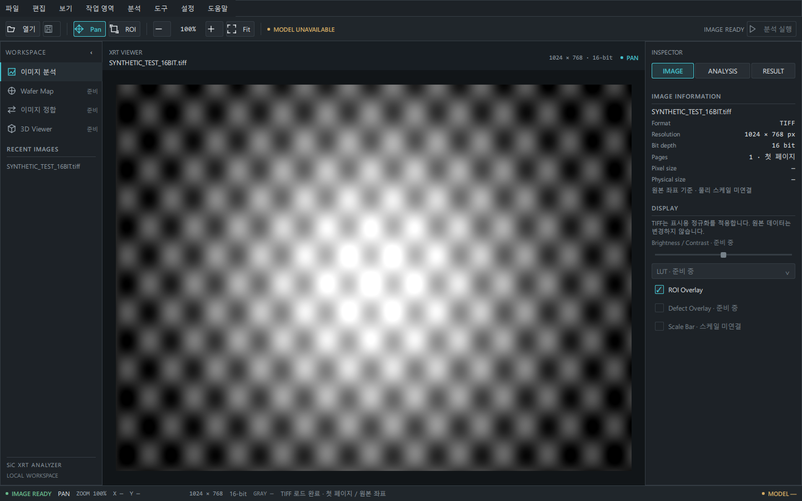
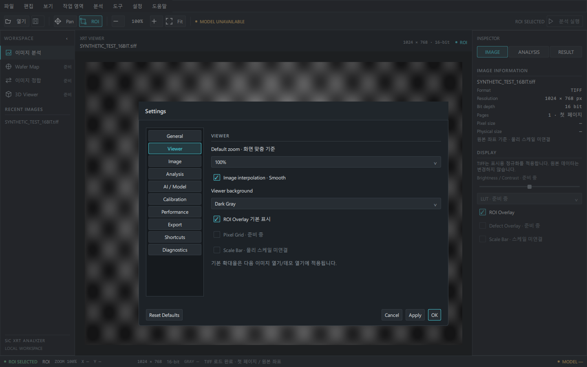

# sic-xrt-analyzer

SiC XRT 이미지를 탐색하는 PySide6/QML 데스크톱 앱입니다. 산업용 Dark Gray 화면, TIFF 뷰어, ROI와 독립 설정창을 제공합니다. **모델 분석은 아직 연결되지 않았습니다.**

## 실행 (Windows PowerShell)

Python 3.11 이상이 필요합니다. 저장소 폴더에서 실행합니다.

```powershell
cd C:\Users\PC-1\capstone\sic-xrt-analyzer
python -m venv .venv
.\.venv\Scripts\python.exe -m pip install -e ".[dev,ui]"
.\.venv\Scripts\python.exe -m sic_xrt_analyzer
```

이미 설치된 이 작업 환경에서는 아래 한 줄로 실행할 수 있습니다.

```powershell
.\.venv\Scripts\python.exe -m sic_xrt_analyzer
```

## 화면과 조작

- **메뉴**: 파일 · 편집 · 보기 · 작업 영역 · 분석 · 도구 · 설정 · 도움말. `Alt+F/E/V/W/A/T/S/H`와 방향키, Enter, Escape로 조작합니다.
- **Command Toolbar**: 열기, 저장(준비 중), Pan/ROI, 축소·배율·확대·Fit, 모델 상태, 분석 실행(미연결). Viewer 내부에는 중복 명령 툴바를 두지 않습니다.
- **Workspace Navigator**: 이미지 분석, Wafer Map, 정합, 3D와 최근 파일. 이미지 분석 외 작업 영역은 준비 안내 화면입니다.
- **Viewer**: `Ctrl+O` 또는 파일 드롭으로 TIFF를 열고, 파일 메뉴에서 합성 데모를 엽니다. Pan(`H`), ROI(`R`), 휠 확대·축소, 화면 맞춤(`Ctrl+0`), 확대·축소(`Ctrl++/-`)를 지원합니다. **100%는 화면 맞춤 기준**입니다.
- **Inspector**: IMAGE는 실제 메타데이터와 ROI 표시, ANALYSIS는 원본 픽셀 기준 ROI 및 분석 준비 상태, RESULT는 결과의 빈 상태를 표시합니다. 설정 메뉴는 Inspector를 바꾸지 않습니다.
- **Status Bar**: 로딩·이미지·ROI·파일 오류 상태, 도구, 배율, 원본 픽셀 좌표, 해상도와 비트 깊이. 원본 Gray 값·물리 스케일·모델·장비가 없으면 `—`로 표시합니다.
- **보기**에서 패널과 상태 표시줄을 숨기고 전체 화면(`F11`) 또는 화면 배치 초기화를 사용합니다. 기본 1440×900, 최소 1100×700입니다.
- `Ctrl+W`로 현재 이미지를 닫고 `Ctrl+Q`로 종료합니다. ROI 좌표는 편집 메뉴에서 복사합니다.

### TIFF 표시 범위

첫 페이지의 숫자형 회색조, RGB/RGBA TIFF를 표시합니다. 8비트는 그대로, 16비트와 부동소수점은 표시 목적으로 1~99 백분위 범위를 8비트로 변환합니다. MINISWHITE와 압축 디코딩을 지원합니다. 긴 변 4096픽셀 이하의 미리보기를 만들며 메타데이터·마우스 좌표·ROI는 **원본 해상도 기준**입니다.

디코딩은 백그라운드에서 수행합니다. 로딩 중 이미지 명령은 비활성화하며 실패하면 상세 파일 오류와 이전 이미지를 유지합니다. 성공한 파일만 최근 목록에 기록합니다. 파일 선택 창을 취소하면 현재 이미지는 유지됩니다. 종료 시 진행 중인 디코딩이 끝날 때까지 기다립니다.

원본 TIFF 파일은 수정하지 않습니다. 다중 페이지 탐색, 실제 크기 100%, 원본 픽셀 값 조회, 밝기·대비·LUT 조절, 물리 스케일은 아직 제공하지 않습니다.

### Settings

`설정 → 설정…`에서 독립 Modal Dialog를 엽니다. General / Viewer / Image / Analysis / AI·Model / Calibration / Performance / Export / Shortcuts / Diagnostics의 10개 카테고리를 제공합니다.

실제 적용 항목: 시작 시 데모, 최근 파일 보관 및 개수(1~10), 이미지 보간, 배경, 기본 확대율, ROI 기본 표시. 사용자별 QSettings에 저장합니다. 보관을 끄면 저장된 최근 목록을 삭제하고 세션 목록만 유지합니다. 기본 확대율은 다음 이미지/데모 열기부터 적용합니다.

- **Cancel**: 마지막 Apply 이후의 변경을 폐기합니다.
- **Apply**: 저장·반영하고 창을 유지합니다.
- **OK**: 저장·반영하고 창을 닫습니다.
- **Reset Defaults**: 확인 후 기본값을 즉시 적용합니다.

미연결 모델·분석·보정·성능·내보내기·로그 설정은 준비 안내와 비활성 컨트롤로 표시합니다. 테마와 언어는 현재 고정입니다. 분석 실행/취소/결과, 프로젝트 저장, Export, 측정, 결함·스케일·격자 레이어도 비활성 상태입니다.

## 화면 캡처와 검증

다음은 **Windows의 실제 Qt 렌더링**입니다. TIFF 화면은 생성한 테스트 데이터이며 실제 검사 데이터가 아닙니다.





[Empty](docs/screenshots/industrial-empty.png) · [General](docs/screenshots/industrial-settings-general.png) · [ANALYSIS / ROI](docs/screenshots/industrial-analysis-roi.png) · [RESULT](docs/screenshots/industrial-result-empty.png) · [1100×700](docs/screenshots/industrial-demo-1100.png)

[메뉴](docs/screenshots/industrial-menu-file.png) · [설정 메뉴](docs/screenshots/industrial-menu-settings.png) · [복원 확인](docs/screenshots/industrial-settings-reset-confirm.png) · [파일 오류](docs/screenshots/industrial-error-retained.png) · [프로그램 정보](docs/screenshots/industrial-about.png)

**Analysis Running / Complete는 검증 불가**: 승인된 모델·분석 백엔드가 없습니다. 진행률·결함·GPU·성능 결과를 생성하지 않습니다. Windows 캡처는 QTest로 조작했습니다. OS 네이티브 파일 선택 창의 열기/취소를 마우스로 수동 확인한 것은 아닙니다.

```powershell
.\.venv\Scripts\python.exe -m ruff check .
.\.venv\Scripts\python.exe -m pytest -q
.\.venv\Scripts\python.exe tools/capture_workstation.py
```

[통합 TD와 검증 기록](docs/td-industrial-ui.md)

## 구조와 경계

`ui/`의 QML 구성요소와 공통 상태·액션, Python 파일/설정 브리지, `imaging/`의 TIFF 로더로 구성됩니다. 공통 Theme·Icon·Button·Checkbox·ComboBox·Slider·Menu·Dialog·InfoRow·SectionHeader·StatusIndicator를 사용합니다.

웨이퍼 맵, 정합, 3D 및 승인된 ONNX 추론은 이 저장소 경계에 속하지만 현재 연결되지 않았습니다. 학습·평가는 sic-xrt-ml, 데이터 변환·검증은 sic-xrt-data-tools에서 담당합니다. 외부 모델 계약 변경은 별도 Issue에서 버전·해시·입출력 규약을 정합니다. 이번 UI 변경은 외부 모델 계약을 변경하지 않습니다.

작업 규칙: [AGENTS.md](AGENTS.md), [공통 handbook](https://github.com/CrystalVision-Lab/engineering-handbook).
