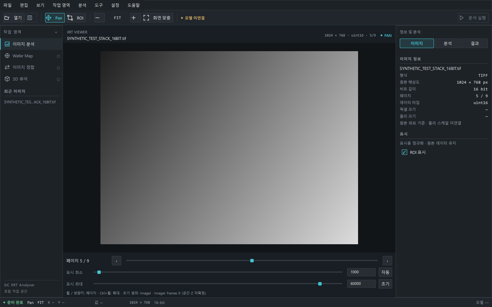
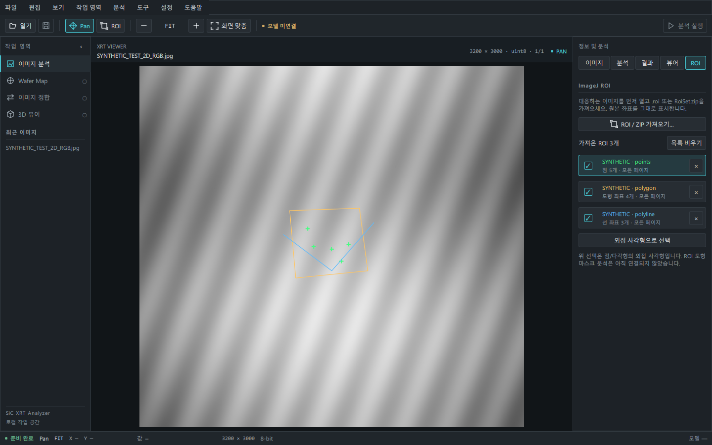
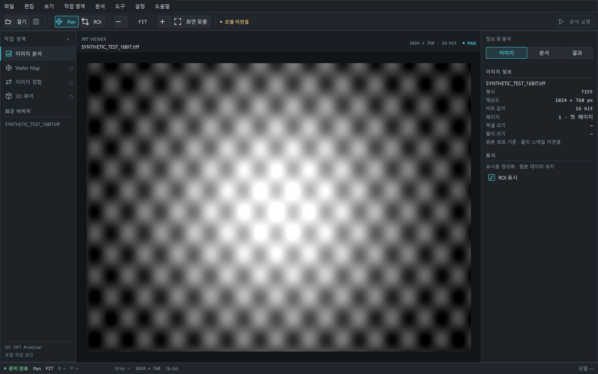
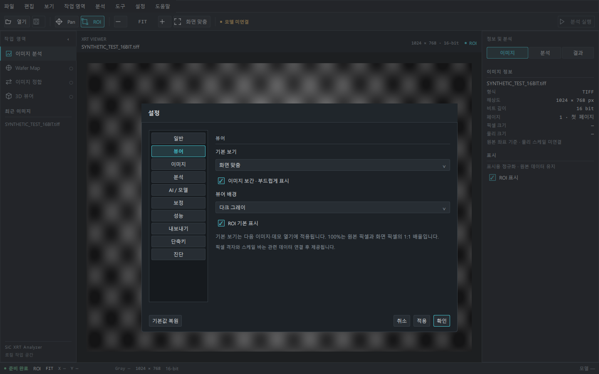

# sic-xrt-analyzer

SiC XRT 이미지를 탐색하는 PySide6/QML 데스크톱 앱입니다. 산업용 Dark Gray 화면, 내부 TIFF 스택·JPG 뷰어, ImageJ ROI 가져오기와 독립 설정창을 제공합니다. **모델 분석과 3D 재구성은 아직 연결되지 않았습니다.**

## 실행 (Windows PowerShell)

Python 3.11 이상이 필요합니다. 저장소 폴더에서 실행합니다.

```powershell
cd C:\Users\PC-1\capstone\sic-xrt-analyzer
python -m venv .venv
.\.venv\Scripts\python.exe -m pip install -e ".[dev,viewer]"
.\.venv\Scripts\python.exe -m sic_xrt_analyzer
```

이미 설치된 이 작업 환경에서는 아래 한 줄로 실행할 수 있습니다. 업데이트 후에는 위의 설치 명령으로 새 의존성을 반영하고 실행 중인 프로그램을 다시 시작하세요. 가상환경 활성화만으로 프로그램이 실행되지는 않습니다.

```powershell
.\.venv\Scripts\python.exe -m sic_xrt_analyzer
```

## 화면과 조작

### Linux에서 실행

저장소 디렉터리에서 Python 3.11 이상으로 실행합니다. Qt 그래픽 세션이 필요합니다.

```bash
python3 -m venv .venv
.venv/bin/python -m pip install -e '.[viewer]'
.venv/bin/python -m sic_xrt_analyzer
```

`viewer`는 스택 보기의 필수 패키지만 설치합니다. [Linux 시스템 의존성과 스택 안내](docs/tiff-stack-viewer.md)를 참고하세요.

- **메뉴**: 파일 · 편집 · 보기 · 작업 영역 · 분석 · 도구 · 설정 · 도움말. `Alt+F/E/V/W/A/T/S/H`와 방향키, Enter, Escape로 조작합니다.
- **Command Toolbar**: 열기, 저장(준비 중), Pan/ROI, 축소·배율·확대·Fit, 모델 상태, 분석 실행(미연결). Viewer 내부에는 중복 명령 툴바를 두지 않습니다.
- **Workspace Navigator**: 이미지 분석, Wafer Map, 정합, 3D와 최근 파일. 이미지 분석 외 작업 영역은 준비 안내 화면입니다.
- **Viewer**: `Ctrl+O` 또는 파일 드롭으로 TIFF/JPG/JPEG를 엽니다. 오른쪽 **뷰어 탭**의 슬라이더·이전/다음 버튼, 이미지 위 휠·방향키로 페이지 이동, Ctrl+휠로 확대합니다. 페이지 탐색과 밝기·대비 조절을 사이드바에 모아 이미지 영역의 높이를 확보했습니다. 기본 **FIT**는 원본 종횡비와 전체 이미지를 유지하며 가장자리에 8px 여백으로 크게 맞춥니다. 설정에서 선택한 기본 배율도 유지합니다. Pan(`H`), ROI(`R`), 화면 맞춤(`Ctrl+0`), 확대·축소(`Ctrl++/-`)를 지원합니다. **100%는 원본 픽셀과 화면 물리 픽셀의 1:1**입니다. 보기 메뉴 또는 `Ctrl+1`로 실제 크기를 표시합니다.
- **Inspector**: IMAGE는 실제 메타데이터와 ROI 표시, ANALYSIS는 원본 픽셀 기준 ROI 및 분석 준비 상태, RESULT는 결과의 빈 상태, VIEWER는 페이지·밝기/대비, ROI는 가져온 ImageJ 형상 목록을 표시합니다. 설정 메뉴는 Inspector를 바꾸지 않습니다.
- **Status Bar**: 로딩·이미지·ROI·파일 오류 상태, 도구, 배율, 원본 픽셀 좌표와 실제 원본 값, 해상도와 비트 깊이. 미연결 물리 스케일·모델·장비는 `—`로 표시합니다.
- **보기**에서 패널과 상태 표시줄을 숨기고 전체 화면(`F11`) 또는 화면 배치 초기화를 사용합니다. 기본 1440×900, 최소 1100×700입니다.
- `Ctrl+W`로 현재 이미지를 닫고 `Ctrl+Q`로 종료합니다. ROI 좌표는 편집 메뉴에서 복사합니다.

### TIFF 표시 범위

숫자형 회색조, 인터리브 RGB/RGBA의 단일 이미지와 multi-page TIFF/BigTIFF, ImageJ contiguous 스택을 표시합니다. 16비트 원본을 유지하고 별도의 표시 범위를 8비트 QImage로 변환합니다. ImageJ min/max 또는 Ranges가 있으면 초기 범위로 사용하며, 없으면 첫 페이지 자동 범위를 사용합니다. 최소/최대 슬라이더·숫자 입력과 자동/초기로 범위를 조절합니다. MINISWHITE와 압축 디코딩을 지원합니다. 긴 변 4096픽셀 이하의 미리보기를 만들며 메타데이터·마우스 좌표·ROI·픽셀값은 **원본 기준**입니다.

디코딩은 백그라운드에서 수행합니다. 로딩 중 이미지 명령은 비활성화하며 실패하면 상세 파일 오류와 이전 이미지를 유지합니다. 성공한 파일만 최근 목록에 기록합니다. 파일 선택 창을 취소하면 현재 이미지는 유지됩니다. 종료 시 진행 중인 디코딩이 끝날 때까지 기다립니다.

파일을 열면 **전체 페이지의 탐색용 화면을 모두 불러올 때까지 로딩 화면을 유지합니다.** 중앙에 `N / 전체` 진행률이 나타나며 스크롤·슬라이더·방향키·확대·표시 범위 변경은 잠깁니다. **100% 준비 완료 후 탐색이 한 번에 활성화**되어 슬라이더를 누른 채 임의 구간을 연속 표시합니다. 읽기 실패 시 잠금을 유지하며 `다시 준비` 또는 `취소`를 선택할 수 있습니다. 로딩 중에도 새 파일 열기와 취소/닫기(`Ctrl+W`)는 가능합니다.

드래그 중에는 기본 긴 변 1024픽셀 이하의 탐색 화면을 표시하고, 손을 놓은 마지막 페이지는 정밀하게 읽습니다. 휠/키 이동도 준비된 화면을 먼저 표시합니다. 탐색 화면은 **최대 512 MiB** 안에서 전체 페이지의 원본 dtype 샘플과 8비트 화면을 보관하며, 필요하면 샘플 크기를 줄입니다. 밝기·대비를 바꿔도 전체 캐시를 유지합니다. 원본 픽셀값은 정밀 읽기 후에만 표시하고 그전에는 `—`입니다.

원본 전체 스택 배열은 만들지 않습니다. raw 캐시는 **최대 3페이지/96 MiB**, 정밀 표시 캐시는 **32 MiB**입니다. 압축·비매핑 TIFF는 **페이지당 64 MiB**의 디코딩 한도, 원본 반환은 128 MiB 한도를 적용합니다. 빠른 이동은 최신 요청을 우선 처리하며 파일 교체·닫기 시 전체 탐색 캐시도 정리합니다. 이 값들은 캐시 버퍼 한도이며 프로세스 전체 RAM 한도는 아닙니다. 축소 시 Inspector에 **원본 해상도와 표시 미리보기 크기**를 따로 표시합니다.

원본 TIFF 파일은 수정하지 않습니다. 1:1은 원본 좌표 격자의 표시 배율입니다. 대형 단일 2D TIFF/JPG는 확대 시 보이는 부분을 원본 해상도로 읽어 겹쳐 표시합니다. 다중 페이지 탐색용 축소 화면의 미세 정보는 정밀 페이지 읽기 전까지 복원되지 않습니다. LUT 선택·물리 스케일·범용 tile streaming은 아직 제공하지 않습니다. ImageJ frames를 공간 Z축으로 가정하지 않습니다. 3D는 순서·방향·실제 간격 확인 이후 별도 단계입니다.



**스택 검증:** 기존 42개 + 스택 17개 + 탐색 성능 회귀 8개 + 전체 탐색 10개 + 초기 로딩 잠금 3개 = **80개 테스트**. 3000×3000 uint16 158장 생성 TIFF에서 전체 준비 후 앞뒤 632회 이동 중 추가 디코딩 0회를 확인했습니다. QML 마우스로 슬라이더를 누른 채 이동하고 놓을 때 마지막 페이지만 정밀 읽는 것도 검증했습니다. 준비 중 입력 차단·100% 후 활성화·실패 시 재시도·취소를 검사했습니다. [구현·성능 측정·검증·제약 문서](docs/tiff-stack-viewer.md)에 기록했습니다. 현재 Windows 환경에서 제공하신 Linux 경로에 접근할 수 없어 **실제 XRT 파일 4개 검증은 아직 미수행**입니다. 해당 Linux에서 다음 읽기 전용 검증 도구를 실행할 수 있습니다.

```bash
.venv/bin/python tools/validate_tiff_stack.py \
  --folder '/run/media/didgmltmd/6E25-3446/3D XRT'
```

### JPG·대형 2D TIFF·ImageJ ROI

- JPG/JPEG를 파일 선택·드롭·최근 파일에서 열고 FIT/Pan/Zoom/밝기·대비를 사용합니다. 메타데이터는 원본 해상도를 표시하며 상태 표시줄 RGB값은 표시 범위 변환 전 JPEG 디코딩 값입니다.
- 약 12k×12k RGB TIFF처럼 원본 페이지가 128 MiB를 넘으면 읽기 전용 mmap에서 제한된 미리보기만 만듭니다. 전체 RGB 배열을 복사하지 않습니다. 확대 시 보이는 원본 영역을 백그라운드에서 읽으며 정확한 커서 픽셀값도 별도 영역 읽기로 조회합니다.
- 이미지를 연 뒤 **파일 → ImageJ ROI 가져오기** 또는 오른쪽 **ROI 탭 → 가져오기**에서 `.roi` 여러 개나 `RoiSet.zip`을 선택합니다. 점·다중 점·다각형·사각형·타원·선을 원본 좌표에 표시하며 개별 숨김·선택·목록 제거가 가능합니다. ZIP은 압축을 풀지 않고 읽습니다.
- **외접 사각형으로 선택**을 누르면 기존 사각형 ROI에 연결됩니다. 다각형·점 마스크 분석은 구현하지 않았으며 JPEG는 보기 전용입니다. TIFF 분석 입력 계약 1.0은 유지합니다.
- 새 이미지 열기 성공·닫기 시 가져온 ROI와 읽기 캐시를 정리합니다. ROI 파일명으로 이미지 대응을 추측하거나 좌표를 자동 확대하지 않으므로 대응하는 이미지에서 가져오세요.

2026-10-02 Windows 실제 데이터에서 **정상 JPG 346개·대형 2D TIFF 9개**의 열기·밝기/대비·원본 부분 읽기와 **ROI 86개**의 파싱을 검증했습니다. JPG 1개는 원본부터 JPEG 형식이 아니고, ROI 2개는 빈 파일입니다. 실제 QML에서도 JPG 1개·TIFF 9개의 확대 정밀 표시와 ROI 외접 좌표를 확인했습니다. 기존 80개에 이번 회귀 검사 15개를 추가하여 **총 95개 테스트**를 사용합니다.



[100% 정밀 영역](docs/screenshots/2d-roi/jpeg-roi-100-detail.png) · [1100×700](docs/screenshots/2d-roi/jpeg-roi-1100.png) · [사용법·메모리 한도·검증 결과·제약](docs/2d-image-roi-viewer.md). 위 캡처는 임시 생성 데이터이며 실제 XRT 이미지는 Git에 포함하지 않습니다.

### 설정

`설정 → 설정…`에서 독립 Modal Dialog를 엽니다. 일반 / 뷰어 / 이미지 / 분석 / AI·모델 / 보정 / 성능 / 내보내기 / 단축키 / 진단의 10개 카테고리를 제공합니다.

실제 적용 항목: 시작 시 데모, 최근 파일 보관 및 개수(1~10), 이미지 보간, 배경, 기본 보기, ROI 기본 표시. 사용자별 QSettings에 저장합니다. 보관을 끄면 저장된 최근 목록을 삭제하고 세션 목록만 유지합니다. 기본 보기은 다음 이미지/데모 열기부터 적용합니다.

- **취소**: 마지막 적용 이후의 변경을 폐기합니다.
- **적용**: 저장·반영하고 창을 유지합니다.
- **확인**: 저장·반영하고 창을 닫습니다.
- **기본값 복원**: 확인 후 기본값을 즉시 적용합니다.

미연결 모델·분석·보정·성능·내보내기·로그 설정은 설명으로만 표시합니다. 테마와 언어는 현재 고정입니다. 분석 실행/취소/결과, 프로젝트 저장, Export, 측정, 결함·스케일·격자 레이어도 비활성 상태입니다.

## 화면 캡처와 검증

다음은 **Windows의 실제 Qt 렌더링**입니다. TIFF 화면은 생성한 테스트 데이터이며 실제 검사 데이터가 아닙니다.





[ROI](docs/screenshots/polish/02-main-roi.png) · [분석](docs/screenshots/polish/03-analysis.png) · [결과 없음](docs/screenshots/polish/04-result-empty.png) · [설정 일반](docs/screenshots/polish/05-settings-general.png) · [1100×700](docs/screenshots/polish/07-minimum-1100x700.png)

[메뉴](docs/screenshots/polish/menu-file.png) · [설정 메뉴](docs/screenshots/polish/menu-settings.png) · [복원 확인](docs/screenshots/polish/settings-reset-confirm.png) · [파일 오류](docs/screenshots/polish/error-retained.png) · [프로그램 정보](docs/screenshots/polish/about.png)

**Production 분석은 미연결**: 승인된 모델이 없습니다. 분석 기반의 Running / Completed / Failed / Canceled, 원본 좌표 변환과 stale 방지는 테스트 전용 어댑터로 검증합니다. Production에서 가짜 결함·GPU·시간을 생성하지 않습니다. Windows 캡처는 QTest로 조작했습니다. OS 네이티브 파일 선택 창의 열기/취소를 마우스로 수동 확인한 것은 아닙니다.

```powershell
.\.venv\Scripts\python.exe -m ruff check .
.\.venv\Scripts\python.exe -m pytest -q
.\.venv\Scripts\python.exe tools/capture_workstation.py
```

[Polish TD와 최신 검증 기록](docs/td-ui-polish.md) · [이전 통합 TD](docs/td-industrial-ui.md)

## 분석 기반 (모델 미연결)

Viewer의 8비트 QImage와 **OriginalImageSource**를 분리했습니다. 분석 입력은 원본 TIFF에서만 읽으며 uint16/float32의 값과 dtype을 유지합니다. `read_region()`은 원본 픽셀의 엄격한 ROI, `read_full()`은 명시적 전체 읽기입니다. 원본 반환 배열 한도는 기본 128 MiB, 비매핑 페이지 디코딩 한도는 64 MiB입니다.

불변 AnalysisRequest/AnalysisResult, ModelAdapter 입출력 계약, Qt 백그라운드 AnalysisPipeline과 협력 취소를 제공합니다. 새 파일·페이지·요청·원본 변경은 이전 작업과 결과를 무효화합니다. ROI만 바꾸면 결과를 유지하고 범위 차이를 추적합니다. UI는 실제 pipeline 상태를 받으며 **모델 미연결로 분석 실행은 비활성화**됩니다. 모델 연결 이후 분석 범위는 전체 이미지/ROI 중 명시적으로 선택해야 합니다.

분석 기반 TD의 42개 테스트에 스택·탐색 성능 38개, 2D 이미지·ROI 회귀 15개를 추가하여 **95개 테스트**로 검증합니다. [계약·좌표·대용량 한계·오류·검증 문서](docs/analysis-pipeline-contract.md)를 참고하세요. 승인 모델, 실제 inference, 분석 결과 Overlay, 결함 목록, Export는 다음 TD 범위입니다.

## 구조와 경계

`ui/`의 QML 구성요소와 공통 상태·액션, Python 파일/설정 브리지, `imaging/`의 분리된 TIFF 원본·미리보기, `analysis/`의 계약·어댑터 Protocol·파이프라인으로 구성됩니다. 공통 Theme·Icon·Button·Checkbox·ComboBox·Slider·Menu·Dialog·InfoRow·SectionHeader·StatusIndicator를 사용합니다.

웨이퍼 맵, 정합, 3D 및 승인된 ONNX 추론은 이 저장소 경계에 속하지만 현재 연결되지 않았습니다. 학습·평가는 sic-xrt-ml, 데이터 변환·검증은 sic-xrt-data-tools에서 담당합니다. 외부 모델 계약 변경은 별도 Issue에서 버전·해시·입출력 규약을 정합니다. 이번 UI 변경은 외부 모델 계약을 변경하지 않습니다.

작업 규칙: [AGENTS.md](AGENTS.md), [공통 handbook](https://github.com/CrystalVision-Lab/engineering-handbook).
