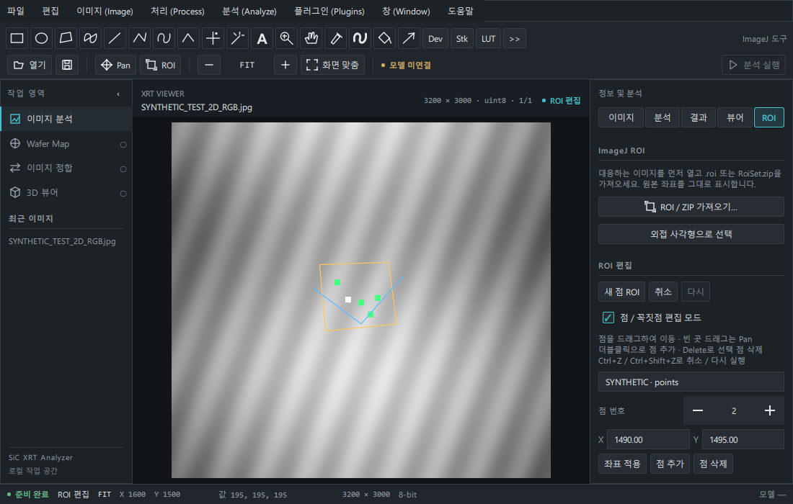

# 선명한 뷰어와 ImageJ 작업창 (Issue #29)

## 실행

Python 3.11+, Java **17 이상**, 64비트 환경을 사용합니다. Java 실행 파일이 PATH에 있어야 합니다. ImageJ 엔진은 선택 의존성입니다. 엔진을 설치하지 않아도 이미지 보기와 일반 선택·ROI 편집은 동작합니다.

Windows PowerShell, 저장소 디렉터리:

```powershell
.\.venv\Scripts\python.exe -m pip install -e ".[dev,viewer,imagej]"
.\.venv\Scripts\python.exe tools/setup_imagej.py
.\.venv\Scripts\python.exe -m sic_xrt_analyzer
```

Linux:

```bash
python3 -m venv .venv
.venv/bin/python -m pip install -e '.[viewer,imagej]'
.venv/bin/python tools/setup_imagej.py
.venv/bin/python -m sic_xrt_analyzer
```

설치 도구는 Maven Central의 ImageJ 1.54p, ij1-patcher 2.0.0, Javassist 3.30.2-GA, ClassGraph 4.8.162를 받고 고정 SHA256을 검사합니다. JAR는 Git에 넣지 않습니다. 기본 위치는 실행 디렉터리의 `artifacts/imagej-runtime`입니다. 다른 디렉터리를 쓰려면 설치 도구의 `--directory`와 환경 변수 `SIC_XRT_IMAGEJ_HOME`을 같은 경로로 지정합니다. 최초 설치 후 엔진은 인터넷 없이 실행합니다.

## 표시 방식

- 기존 2048픽셀 정밀 영역 제한과 확대 중 저해상도 미리보기로 돌아가는 경로를 대체했습니다.
- 큰 JPG는 원본 RGB를 한 번 디코딩하여 읽기 전용 임시 mmap으로 저장합니다. TIFF는 가능한 경우 원본의 읽기 전용 mmap을 사용합니다.
- 처음 열 때 2배씩 줄인 **영역 평균 표시 계층**을 임시 디스크에 만듭니다. 표시 계층까지 준비된 뒤 입력을 활성화합니다.
- 다중 페이지 TIFF의 축소 탐색 캐시에는 각 페이지의 정밀 표시 계층도 먼저 준비합니다. 압축 페이지는 한 페이지의 원본을 임시 mmap으로 복사하며 전체 스택을 RAM 배열로 보관하지 않습니다.
- 현재 화면의 물리 픽셀 수에 맞는 계층에서 보이는 부분만 그립니다. 확대·이동 때 TIFF/JPEG 디코더를 다시 호출하지 않습니다. 배율 100% 이상에서는 원본 계층과 최근접 보간을 사용합니다. 확대 시 원본 픽셀 격자가 보이는 것은 정상이며 원본에 없는 세부 정보는 생성하지 않습니다.
- 밝기·대비는 원본 값에 별도 표시 LUT를 적용합니다. 원본 16비트 값과 커서 조회 값은 유지합니다. ImageJ 색상 LUT를 저장한 TIFF도 원본 인덱스 값과 표시 색상을 분리합니다.
- 화면 크기의 래스터만 Qt 텍스처로 전달합니다. 큰 이미지를 하나의 거대한 GPU 텍스처로 올리지 않습니다. Python 페인팅과 네이티브 캡처의 대기를 피하도록 Qt `basic` 렌더 루프를 사용합니다.
- 스택 RAM 탐색 캐시 512MiB, 원본 페이지 캐시 96MiB/3페이지, 기본 표시 캐시 32MiB를 유지합니다. 스택의 추가 디스크 표시 캐시 한도는 4GiB이며 여유 디스크 공간도 검사합니다. 계층의 추가 크기는 대략 원본 데이터의 1/3입니다. JPEG 원본 디코딩 캐시 한도는 2GiB입니다.
- 파일 교체·닫기 때 캐시를 정리합니다. 다음 파일 열기가 실패하면 이전 이미지와 표시 캐시를 유지합니다. 같은 파일의 재열기도 별도 캐시 소유권으로 처리합니다.

## 툴바

| 사진의 도구 | 제공 동작 |
|---|---|
| 사각형·타원 | 드래그로 영역 ROI 생성, 해당 ImageJ ROI 형식 저장 |
| 다각형 | 클릭으로 꼭짓점 추가, 더블클릭/Enter로 완료, Esc 취소 |
| 자유 영역 | 드래그 경로를 닫은 영역으로 생성 |
| 직선·분할선·자유선 | 드래그 또는 연속 클릭, 길이/프로파일의 선택 입력 |
| 각도 | 3회 클릭, ImageJ ANGLE ROI로 저장·측정 |
| 점 | 클릭한 원본 좌표를 점 ROI에 추가 |
| 완드 | ImageJ Wand의 연결 영역 선택, 도구 옵션의 허용오차 사용 |
| 텍스트 | 옵션의 텍스트를 클릭 위치에 비파괴 Text ROI로 생성·저장 |
| 확대·이동 | 클릭 확대, Alt+클릭 축소, Pan 드래그, 휠/Ctrl+휠, Fit/100% |
| 색 추출 | 클릭한 원본 픽셀에서 그리기 색 선택 |
| 브러시·채우기 | ImageJ processor로 작업 복사본을 그리기/연결 영역 채우기. 원본 보존 |
| 화살표 | 드래그로 Arrow ROI 생성·저장 |
| Dev | 매크로 편집·실행, Java 플러그인 실행, 명령 기록, 전체 명령 검색 |
| Stk | 처음/이전/다음/마지막 페이지, 전체 스택 전달, 페이지 축 투영·복제·반전 명령 |
| LUT | Grays/Fire/Ice/Spectrum 및 기본 색상 LUT, Invert LUT |
| >> | 색상·크기·허용오차·텍스트 옵션, ROI 편집/관리, 매크로·플러그인 접근 |

점·꼭짓점 드래그, 수치 좌표 수정, 점 추가·삭제, 전체 이동, ROI 실행 취소/다시 실행, 새 ZIP 저장도 유지합니다. 브러시·채우기의 작업 복사본은 기존 뷰어에 표시합니다. 같은 크기의 처리 결과는 ROI와 현재 배율을 유지하고, 크기가 바뀌는 처리는 이전 ROI 목록을 정리합니다.



## 메뉴와 분석

`파일 · 편집 · 이미지(Image) · 처리(Process) · 분석(Analyze) · 플러그인(Plugins) · 창(Window) · 도움말` 순서입니다. 이미지 형식 변환, 밝기·대비, 자르기·복제·회전·뒤집기, 필터·이진 형태 처리·노이즈·배경 제거·FFT, 측정·히스토그램·선 프로파일·입자 분석·스케일 설정에 접근합니다.

명령 창에서 ImageJ의 영어 명령 이름과 **매크로 옵션**을 입력하여 실행합니다. 예: `Gaussian Blur...` / `sigma=2`. 대화상자에 의존하는 명령은 옵션을 명시해야 합니다. 등록된 416개 명령을 검색할 수 있지만, 등록 여부가 GUI 없이 실행 가능하다는 보장은 아닙니다. 히스토그램과 선 프로파일은 Java 창 대신 앱 내부 그래프·표로 표시하고 TSV로 복사합니다. 기존 승인 모델 분석은 계속 미연결 상태이며 ImageJ 측정과 구분합니다.

## 매크로·플러그인 호환

별도의 ImageJ/Fiji 앱이나 실행 파일을 실행하지 않습니다. 앱이 관리하는 Python 작업 프로세스 안에 JPype로 JVM과 ImageJ 1.x 엔진을 로드합니다. Qt와 JVM을 분리하여 UI 렌더 대기·Java 오류가 뷰어를 멈추지 않도록 했습니다. 작업 취소는 이 엔진 프로세스를 종료하며 다음 요청에서 다시 시작합니다. 취소 후 플러그인 경로는 다시 등록해야 합니다.

- `.ijm`/`.txt` 편집·실행 및 명령 기록을 제공합니다. 원본 픽셀의 작업 복사본과 현재 선택 ROI를 ImagePlus로 전달합니다.
- `.jar` 또는 `.class`의 경로를 등록하고 Java 클래스 전체 이름과 인수를 지정합니다. ImageJ 1.x `PlugIn` 및 `PlugInFilter` 방식으로 실행합니다. 의존 JAR도 각각 등록해야 하며 경로 등록은 현재 엔진 세션에 적용됩니다.
- 매크로에서 만든 현재 결과 이미지와 **다중 페이지 결과 전체**를 임시 TIFF로 저장하여 내부 뷰어에 표시합니다. 결과표·로그를 작업창에 표시합니다. 실패한 명령의 부분 편집은 다음 작업에 재사용하지 않습니다.
- 전체 TIFF 스택 체크는 페이지 순서 그대로의 ImageJ 가상 스택을 전달합니다. 선택한 현재 페이지부터 시작합니다. 가상 스택에 대한 임의 플러그인의 편집 보존 여부는 플러그인 동작에 따라 달라집니다. 스택 투영 명칭 `Z Project`를 사용해도 촬영 frames를 물리 공간 Z로 확정하지 않습니다.
- ImageJ 1의 TIFF 리더를 위해 4GiB 미만 BigTIFF는 읽기 전용 원본에서 임시 classic TIFF 작업 복사본을 만든 후 전체 스택을 전달합니다. 데이터가 4GiB 이상인 BigTIFF의 전체 스택 처리는 명시적으로 거부하며 현재 페이지 처리는 가능합니다. 결과도 용량이 허용하면 classic TIFF로 저장하여 재처리를 지원합니다. 색상 LUT와 표시 범위는 ImageJ 메타데이터로 보존합니다.
- 처리 단계는 Java의 작업 복사본에 메모리가 필요합니다. RGB 페이지는 Java에서 4바이트/픽셀을 사용합니다. 페이지당 2억 픽셀, JVM 최대 힙 3GiB를 적용하며 큰 스택을 전체 복제하는 명령은 메모리가 부족할 수 있습니다.

**ImageJ 전체를 완전히 대체하거나 모든 플러그인과 호환되는 버전은 아닙니다.** AWT/Swing 창을 직접 요구하는 플러그인, Fiji/ImageJ2 전용 플러그인 및 외부 네이티브 의존성은 현재 보장하지 않습니다. 매크로의 사용자 대화상자·ImageJ 전용 창/툴바 조작·UI 기반 ROI Manager 명령은 제한됩니다. 네이티브 툴바에 임의 IJM/Java 마우스 도구 콜백을 설치하는 호환 계층, 물리 3D 재구성, 다중 이미지 창 관리와 전체 편집 이력도 별도 구현이 필요합니다. `>>`는 현재 제공하는 도구·옵션에 접근하는 메뉴이며 임의 ImageJ toolset 설치를 모사하지 않습니다.

원본 TIFF/JPEG/ROI/ZIP과 `sources/`는 변경하지 않습니다. 매크로·플러그인은 일반 사용자 권한의 코드이며 임의 파일 I/O까지 차단하는 샌드박스는 아닙니다. 앱의 작업 복사본에는 원본의 저장 파일 정보 연결을 제거합니다. 실행 결과는 임시 파일이므로 앱 종료 전에 `Ctrl+S` / 파일 → 이미지 복사본 저장으로 같은 TIFF/JPEG 형식의 새 파일을 저장하세요. 다중 페이지 TIFF는 전체 파일을 복사하고 ROI는 별도 ZIP으로 저장합니다. 측정표는 파일 → 측정 결과 TSV 저장으로 내보냅니다. 기존 파일명은 거부합니다. ImageJ RGB 처리에서 RGBA 입력의 알파 채널은 보존되지 않습니다.

## 검증 (2026-10-02, Windows)

- 자동 검사 **116개**: 기존 동작, 평균 계층, 확대 원본 픽셀 일치, 확대 중 디코더 호출 금지, QML 좌표 바인딩·마우스 도구, ROI 형식과 Text/Arrow 저장·재읽기, 스택 정밀 표시 사전 준비 및 해제, 8/16비트 LUT·표시 범위·원본 값 보존, 실제 IJM와 컴파일한 Java PlugIn/PlugInFilter 실행, 다중 페이지 매크로 출력과 최대값 투영, BigTIFF 스택 투영, 브러시·채우기·프로파일, 매크로 취소와 엔진 재시작, 이미지/TSV 복사본 저장과 덮어쓰기 거부.
- 실제 사용자 `2D XRT` 폴더: 12k급 JPG 4개와 TIFF 9개 사전 준비·영역 읽기·밝기 범위 재표시, ROI 86개 복사본 저장·재읽기 통과. 2개의 빈 ROI는 오류로 보고했습니다. 파일 크기·mtime와 ROI 원본 바이트가 유지되었습니다. 실제 데이터와 파생 이미지는 Git에 넣지 않았습니다.
- 실제 `After annealing_1.jpg` (12349×12273): 1200×800 래스터의 5/10/25/50/100/200/400% 표시 각 10회 검사. 100% 이상에서 중앙 원본 RGB값이 일치했습니다. 초기 준비 11.56초, 추가 계층 약 151MB. 페인팅 중앙값은 100% 13.26ms, 200% 4.52ms, 400% 2.09ms였습니다. 이는 CPU 페인팅 측정이며 전체 UI/GPU FPS가 아닙니다. OS 캐시·장비·메모리 압력에 따라 달라집니다.
- 1440×900 및 1100×700 합성 자료 화면 캡처, QML 경고 없음. TIFF 16비트 다중 페이지는 합성 자료로 검증했습니다. 현재 환경에서 접근할 수 없는 Linux `3D XRT`의 원본 4개는 검증했다고 보고하지 않습니다.

재검증:

```powershell
.\.venv\Scripts\python.exe -m pytest -q
.\.venv\Scripts\python.exe tools/validate_prepared_viewer.py "C:\Users\PC-1\OneDrive\Desktop\캡스톤 디자인\2D XRT" --output artifacts/imagej-prepared-validation.json
.\.venv\Scripts\python.exe tools/validate_prepared_zoom.py "C:\Users\PC-1\OneDrive\Desktop\캡스톤 디자인\2D XRT\After annealing_1.jpg" --output artifacts/prepared-zoom-real.json
```

아주 큰 파일은 OS가 mmap 페이지를 회수할 경우 디스크 페이지 폴트로 지연될 수 있습니다. 원본 해상도를 넘는 확대는 원래의 픽셀 크기를 키우는 동작입니다. JPG 손실 압축 자체의 화질은 복원하지 않습니다. JPEG EXIF 자동 회전은 적용하지 않습니다. TIFF 압축 페이지 디코딩 64MiB 한도 등 기존 읽기 제한도 유지합니다. 비정상 종료 시 임시 캐시가 남을 수 있습니다.

참조: [ImageJ 도구 공식 안내](https://imagej.net/ij/docs/guide/146-19.html), [처리 메뉴](https://imagej.net/ij/docs/guide/146-29.html), [공식 다운로드](https://imagej.net/ij/download.html), [ImageJ 패처와 headless 호환 범위](https://github.com/imagej/ij1-patcher), [JPype](https://jpype.readthedocs.io/en/latest/userguide.html).
