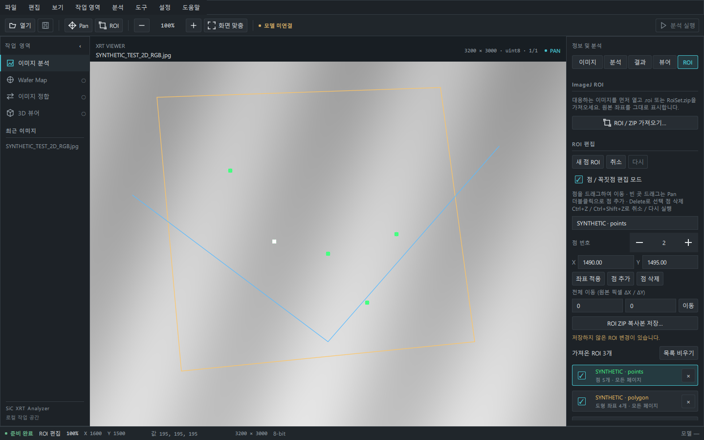

# 정밀 표시 사전 준비와 ROI 편집

Issue #27. 기존 [2D 이미지·ROI 뷰어](2d-image-roi-viewer.md)에 사전 준비와 편집을 추가합니다. 외부 분석 계약은 **1.0**으로 유지하고 `sources/` 및 다른 저장소는 변경하지 않습니다.

## 1. 파일을 먼저 준비하고 탐색 열기

큰 JPG는 파일 열기 worker에서 **원본 해상도로 한 번 디코딩**합니다. [imagecodecs의 JPEG 디코더](https://github.com/cgohlke/imagecodecs/blob/master/imagecodecs/_jpeg8.pyx)가 임시 디스크 memory map에 출력하도록 합니다. 인코딩된 입력도 읽기 전용 mmap이며 전체 파일 bytes/전체 decoded NumPy RAM 배열을 추가로 만들지 않습니다.

- 디코딩·캐시 준비·미리보기 생성이 끝나기 전에는 새 이미지 게시와 탐색 활성화를 하지 않습니다. 중앙 로딩 화면에 JPEG 디코딩 단계 또는 TIFF 준비 진행을 표시합니다. JPEG 디코더는 내부 진행률을 제공하지 않으므로 단계 진행(0/1)이며 시간 비율이 아닙니다.
- 준비 후 JPEG의 확대 정밀 영역과 원본 픽셀은 캐시에서 복사합니다. 원본 JPG를 다시 디코딩하지 않습니다. 표시 범위 변경도 준비된 원본 샘플로 처리합니다.
- 단일 TIFF가 128 MiB를 넘는 경우 읽기 전용 mmap의 모든 OS 페이지를 128행 밴드로 미리 접근한 뒤 탐색을 엽니다. TIFF 전체 원본 배열을 복사하지 않습니다. 기존 다중 페이지 스택은 전체 탐색 화면 준비 정책을 유지합니다.
- 정밀 영역 요청의 기존 70ms 지연은 제거했습니다. 영역 QImage 생성과 GPU 표시까지 미리 끝낼 수는 없으므로 Pan/Zoom 뒤에는 제한된 영역 변환·게시 작업이 있습니다. 원본 영역 읽기 오류는 계속 표시합니다.
- 파일 교체·닫기·취소·준비 실패 때 소유한 임시 캐시를 닫고 지웁니다. 진행 중인 native JPEG 디코더는 강제 중단하지 않으며 디코딩 완료 직후 취소 상태를 검사하고 결과를 폐기합니다. GUI는 계속 반응합니다. 원본 변경은 size/mtime으로 검사합니다.

### 메모리와 디스크

약 12k×12k RGB JPEG는 **약 430 MiB 임시 디스크**가 필요합니다. 캐시 최대 크기는 **2 GiB**, 여유 공간 64 MiB를 추가로 확인합니다. 일반 시스템 임시 폴더의 `sic-xrt-viewer-*`에 앱 소유 캐시만 생성합니다. 정상 닫기/교체/실패에서 제거하지만 강제 프로세스 종료·OS 종료에서는 임시 폴더가 남을 수 있습니다.

원본 해상도 cache는 디스크 map입니다. OS가 캐시를 RAM에 올리거나 메모리 압박 때 다시 내릴 수 있어 프로세스 전체 RAM 상한 또는 모든 상황에서의 무지연을 보장하지 않습니다. 특히 TIFF의 OS 캐시 eviction 뒤에는 디스크 접근이 다시 생길 수 있습니다. 축소 resident 샘플 32 MiB, 가시 정밀 영역 2048×2048 이하/작업 추정 32 MiB, 원본 반환 128 MiB, 큰 압축 TIFF 제한은 유지합니다. JPEG는 RGB uint8 디코딩 값이며 원시 16-bit 촬영 데이터가 아닙니다. EXIF 자동 회전은 적용하지 않습니다.

## 2. ROI 편집 사용법

1. 이미지를 열고 **ROI 탭**에서 대응하는 `.roi`/`RoiSet.zip`을 가져옵니다. 아래 목록에서 편집할 ROI 이름을 선택합니다.
2. **점 / 꼭짓점 편집 모드**를 켭니다. 선택 ROI 좌표에는 사각 핸들이 보이고 현재 점은 흰색입니다.
3. **핸들을 드래그**하여 좌표를 바꿉니다. 빈 곳 드래그는 Pan입니다. 클릭 가능한 거리는 화면 기준 8px이며 원본 좌표로 변환합니다.
4. **더블클릭**으로 점을 추가합니다. 점 ROI는 뒤에 추가하고 선·다각형은 현재 꼭짓점 뒤에 삽입합니다. **Delete**로 선택한 점을 삭제합니다. 최소 좌표 수(점 1/선 2/다각형 3)는 유지합니다.
5. 점 번호로 선택하고 **X/Y → 좌표 적용**으로 소수 좌표를 수정할 수 있습니다. **전체 이동 ΔX/ΔY**는 모든 좌표를 원본 픽셀만큼 이동합니다. 이미지 밖·NaN·무한대는 거절하고 기존 형상을 유지합니다.
6. 이름을 수정하거나 **새 점 ROI**를 생성할 수 있습니다. 새 ROI는 이미지 중앙에 점 하나로 시작합니다. 스택에서는 현재 페이지에 연결합니다.
7. **취소 / 다시** 또는 이미지 위 **Ctrl+Z / Ctrl+Shift+Z**로 되돌립니다. 한 번의 드래그는 실행 취소 한 단계입니다. 목록 제거·비우기도 되돌릴 수 있습니다. 기록은 최대 10단계이며 기록의 총 좌표 수 200,000개를 넘으면 오래된 단계를 버립니다.
8. **ROI ZIP 복사본 저장…**으로 새 `.zip`을 저장합니다. 기존 파일을 선택하면 거절하므로 새 이름을 사용하세요. 이미지 교체·닫기·데모·종료 때 미저장 변경이 있으면 버리기/취소를 묻습니다.

편집은 원본 이미지 좌표의 **앱 메모리 복사본**에서 수행합니다. 원본 TIFF/JPG/ROI/ZIP을 수정·덮어쓰기·삭제하지 않습니다. 확대/FIT/Pan에도 편집 형상이 원본 좌표에 정렬되며 분석용 외접 사각형은 기존 버튼으로 명시적으로 다시 선택합니다. 편집만으로 이전 분석 요청의 Region을 자동 수정하지 않습니다.

### ROI 저장 범위

[roifile](https://github.com/cgohlke/roifile)로 이름·stroke 색·원본 좌표·flat 페이지 위치를 저장합니다. 점 ROI는 POINT, 선은 POLYLINE, 닫힌 도형은 POLYGON으로 내보냅니다. **사각형/타원은 표시된 경로를 다각형으로 저장**하며 타원은 근사 경로입니다. 원본 ROI subtype·스타일·추가 카운터 등 모든 메타데이터를 원본 바이트대로 보존하는 편집기가 아닙니다. 복합 경로 ROI 편집/저장은 지원하지 않습니다. 새 ZIP의 멤버명은 순번이며 ROI 이름은 내부에 유지합니다. 숨김 상태는 뷰어 설정이므로 저장되는 ROI 목록에는 숨긴 ROI도 포함됩니다.

다각형 mask 분석, 특수 회전 도형·텍스트·화살표, 촬영 방향/공간 간격 교정, 3D 재구성, 모델 분석은 이번 범위 밖입니다. JPEG는 계속 뷰어 전용 소스이며 TIFF 분석 입력 계약과 읽기 한도는 변경하지 않습니다.

## 검증 (2026-10-02, Windows)

| 검사 | 결과 |
|---|---|
| 기존 + 신규 자동 테스트 | **104 passed**; Ruff·compileall PASS |
| 큰 JPG 4개 (약 12k×12k) | 원본 해상도 사전 디코딩 완료 후 부분 읽기·표시 범위 변경 PASS |
| 큰 단일 RGB TIFF 9개 | 사전 접근·원본 부분 읽기·표시 범위 변경 PASS |
| 유효 ROI 86개 | 모든 점을 0.25px 이동한 임시 ZIP 저장/재읽기 좌표 일치, 원본 bytes 유지 |
| 빈 ROI 2개 | 기존 오류 유지; 편집·저장 대상으로 취급하지 않음 |
| QML 실제 입력 | 핸들 mouse press/move/release, 숫자 좌표 적용, 더블클릭 추가, Delete, 미저장 닫기 취소, 비동기 저장 PASS |
| 캐시 수명 | 준비 중 입력 잠금·취소, 실패 시 이전 화면 유지, 임시 캐시 정리, 준비 후 추가 JPEG decode 0회 PASS |
| 원본 보존 | 실제 이미지 size/mtime·ROI bytes 미변경 |

이 Windows 환경에서 큰 JPG 사전 준비는 **1.51–2.41초**, 준비 후 512×512 영역 20회 읽기는 합계 **14.8–15.6ms**였습니다. TIFF 준비는 0.21–0.56초, 20회 영역 읽기는 합계 42.7–48.7ms였습니다. OS 파일 캐시가 존재할 수 있으며 캐시가 없는 최초 디스크 접근·GPU 업로드·모니터 FPS를 측정한 수치가 아닙니다. 실파일 배치 도구의 ROI 경계 검사는 가장 큰 TIFF 기준이며 촬영 이미지 자동 대응을 의미하지 않습니다.

```powershell
.\.venv\Scripts\python.exe -m sic_xrt_analyzer
.\.venv\Scripts\python.exe -m ruff check .
.\.venv\Scripts\python.exe -m pytest -q
# 읽기 전용 실제 검사; 편집 ZIP은 도구 소유 임시 폴더에만 만들고 정리:
.\.venv\Scripts\python.exe tools/validate_prepared_viewer.py "<2D XRT 폴더>" --output artifacts/prepared-viewer-validation.json
# Windows Qt 합성 화면 캡처:
.\.venv\Scripts\python.exe tools/capture_2d_roi.py --editor
```



[FIT 편집 화면](screenshots/roi-editor/jpeg-roi-fit.png) · [1100×700](screenshots/roi-editor/jpeg-roi-1100.png)

캡처는 임시 생성 JPG/ROI의 Windows native Qt 화면이며 실제 XRT 데이터를 Git에 포함하지 않습니다. Linux CI는 offscreen이며 Linux 그래픽 세션 및 네이티브 파일 dialog의 수동 검증은 별도입니다.
