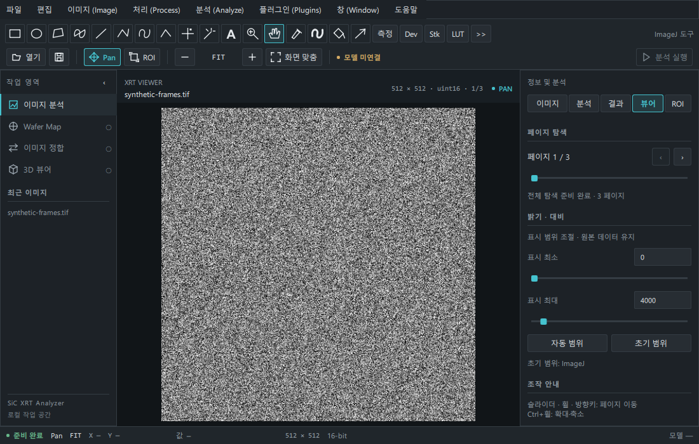
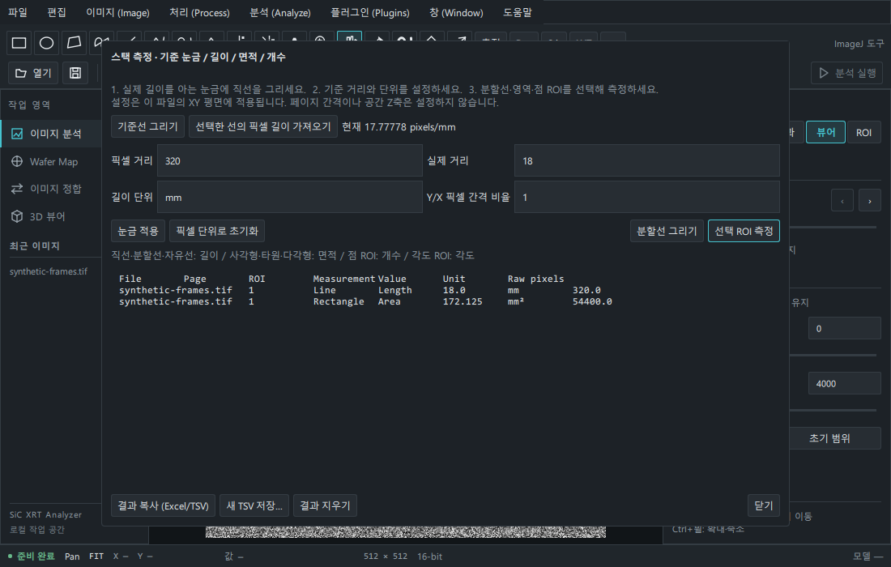

# 스택 전용 측정 · Java GUI · Fiji/ImageJ2 (Issue #36)

## 표시 조건

이미지 분석 작업 영역에서 **TIFF/BigTIFF이고 페이지가 2장 이상**인 파일을 열면 고급 도구줄, 처리/플러그인 메뉴, 형식 변환·필터·측정·매크로 항목을 표시합니다. 파일명에 `3D`가 있는지는 검사하지 않습니다. JPG·단일 TIFF·데모에서는 숨기며 Python 실행 경계에서도 해당 처리를 거부합니다. 기본 Pan/Zoom/밝기·대비와 ROI 가져오기·편집은 2D 파일에서도 유지합니다.

스택에서 생성한 단일 페이지 작업 결과는 해당 스택 세션의 결과이므로 도구를 유지합니다. 새 외부 2D 파일을 열거나 이미지를 닫으면 이 맥락을 해제합니다. 이는 공간 Z를 확정하는 분류가 아닙니다. ImageJ frames와 페이지 순서는 물리 깊이·촬영 방향·실제 간격으로 해석하지 않습니다.



[단일 2D TIFF 화면](screenshots/stack-workbench/single-1100.png)은 도구줄과 처리/플러그인 메뉴를 숨깁니다. 캡처는 생성한 자료이며 실제 XRT 데이터가 아닙니다.

## 눈금 설정과 측정

[사용자가 제공한 글](https://m.blog.naver.com/cutegirl8856/222157260601)의 기준 눈금 설정 → 선을 따라 측정 → Excel로 결과 전달 흐름을 앱 내부에 구현했습니다.

1. 스택을 열고 **측정** 또는 분석 → **스케일 · 길이 / 면적 / 개수 측정**을 선택합니다.
2. **기준선 그리기**로 실제 길이를 아는 눈금에 선을 그립니다. 다시 측정 창에서 **선택한 선의 픽셀 길이 가져오기**를 누릅니다.
3. 실제 거리와 `mm`, `µm` 등 단위를 입력하고 **눈금 적용**을 누릅니다. 예: 320 pixels가 18 mm이면 17.77778 pixels/mm입니다. 정사각형 픽셀은 Y/X 비율 1이며, 비정사각형 픽셀의 기준선은 가로 눈금으로 설정하세요.
4. 직선·분할선·자유선 ROI는 길이, 사각형·타원·다각형은 면적, 점 ROI는 개수, 3점 각도 ROI는 각도를 측정합니다. 분할선은 연속 클릭 후 Enter/더블클릭으로 완료합니다.
5. **결과 복사 (Excel/TSV)**로 표를 붙여 넣거나 **새 TSV 저장**을 선택합니다. 기존 파일을 덮어쓰지 않습니다.



XY 단위 설정은 같은 파일의 페이지에 적용하고 ImageJ 실행 입력에도 전달합니다. 외부 파일 교체와 크기를 바꾸는 처리에서는 초기화합니다. 각 결과에 파일·페이지·ROI·측정 종류·값·단위·원래 픽셀 기준 값을 기록합니다. 길이와 면적은 ROI 기하학 계산이며 픽셀 평균/최소/최대는 ImageJ Measure를 사용합니다. 역사적 결과 행은 새 파일에서도 파일명을 포함한 채 유지하며 **결과 지우기**로 비웁니다. 이미지 픽셀을 편집하는 작업이 아닙니다.

구멍이나 여러 윤곽이 있는 복합 ROI의 기하학 측정은 이 창에서 거부합니다. 해당 ROI는 ImageJ Measure를 사용하세요. 새 파일 열기가 실패하면 이전 작업 이미지의 스택 맥락과 눈금은 유지합니다.

## AWT/Swing 플러그인 설정창

스택에서 플러그인 → Java 플러그인 등록/실행을 열고 **플러그인 설정창 사용 (AWT/Swing)**을 켭니다. 기본 옵션 실행 모드는 유지하며, GUI 모드는 작업 엔진을 다시 시작합니다. `.jar`/`.class` 경로를 등록한 뒤 Java 클래스 전체 이름과 인수를 실행합니다. 기본 ImageJ 명령도 GUI 모드에서 옵션을 비우면 자체 설정창을 열 수 있습니다.

- 앱의 Python 작업 프로세스에 JVM을 로드하고 `java.awt.headless=false`로 실행합니다. ImageJ/Fiji 실행 파일을 호출하지 않습니다.
- JVM의 표시된 AWT/Swing 창을 JNA로 추적하고 Qt `QWindow.fromWinId()`로 메인 창 안의 전용 Qt 컨테이너에 연결합니다. 외부 창 타입을 보존하고 메인 화면과 플러그인 창의 수명 연결을 분리합니다. 여러 창은 탭으로 선택합니다. 창 추적은 처리 스레드와 별개로 실행하므로 모달 Java 설정창이 명령을 기다려도 Qt는 계속 동작합니다.
- 설정창에서 값을 입력하고 확인합니다. **작업 취소 / 창 닫기**, 새 파일 열기와 이미지 닫기는 앱 소유 엔진을 종료하고 창을 정리합니다. 다음 요청은 엔진을 다시 시작하며 등록 경로는 유지합니다.
- Windows와 Linux `xcb` 플랫폼(X11 또는 XWayland)을 대상으로 합니다. Wayland 세션에서는 `QT_QPA_PLATFORM=xcb`로 실행하고 XWayland/Qt XCB 패키지를 설치하세요. 순수 Wayland·macOS·오프스크린 플랫폼의 외부 native 창 포함은 제공하지 않습니다.

## Fiji/ImageJ2

**Java 21 이상**이 필요합니다. 기본 ImageJ 1은 Java 17 이상을 사용할 수 있습니다.

```powershell
.\.venv\Scripts\python.exe tools/setup_imagej.py
.\.venv\Scripts\python.exe tools/setup_fiji.py
.\.venv\Scripts\python.exe -m sic_xrt_analyzer
```

Linux는 `.venv/bin/python`을 사용합니다. 앱의 **Fiji 라이브러리…**에서 `artifacts/fiji-runtime`을 선택한 후 **Fiji / ImageJ2 → Fiji 명령 읽기**를 누릅니다. 이름/클래스 검색으로 선택하면 입력 이름·타입이 나타납니다. 추가 인수는 JSON 객체로 지정합니다. 예:

```json
{"value": 0.5, "preview": false, "allPlanes": true}
```

위 인수는 `net.imagej.plugins.commands.assign.MultiplyDataValuesBy`에 사용할 수 있습니다. 현재 이미지의 ImagePlus/Dataset/ImageDisplay 입력을 자동으로 연결하고 SciJava 초기화·서비스 주입·입력 검증을 수행합니다. 이미지 출력 또는 수정된 입력 Dataset은 TIFF 작업 복사본으로 내부 뷰어에 반환하고 기타 출력은 로그에 표시합니다. SciJava의 출력 창 자동 표시 단계는 실행하지 않습니다. 다른 이미지나 임의 ImgLib2 객체·장치·특수 매개변수 연결은 현재 자동 제공하지 않습니다.

### 선택 ROI 전달 (Issue #39)

- 앱에서 선택한 **사각형·타원·다각형·자유영역·직선·분할선·자유선·점**의 단일 경로를 Fiji Overlay로 전달합니다. 원본 XY 좌표와 Dataset의 XY 단위/눈금을 유지합니다. 선의 여러 구간은 LineOverlay의 합집합이며 영역으로 닫지 않습니다.
- ImageDisplay에 선택 Overlay를 활성화하고, Command가 요구하는 `Overlay` 또는 호환되는 구체 Overlay 입력을 자동 연결합니다. 선택 ROI가 필요한데 없거나 입력 형태가 다르면 오류로 표시합니다. 복합 경로·텍스트·화살표·각도는 이 연결에서 거부합니다.
- **Overlay 또는 ImageDisplay의 선택을 사용하는 명령**이 선택 영역을 처리합니다. Dataset만 순회하거나 ROI를 무시하는 외부 명령의 동작을 강제로 제한하지 않습니다. 선택 영역 지원 여부는 해당 명령을 확인하세요. 결과 로그에도 이 조건을 표시합니다. Java ROI Manager와 앱 목록의 양방향 동기화는 아직 없습니다.
- 예: 사각형 ROI 선택 → Fiji 명령에서 위 클래스 검색 → `{"value":0.5,"preview":false,"allPlanes":false}` → 실행. 영역 안의 값만 절반으로 변경한 작업 복사본을 표시합니다. uint16 결과는 Fiji의 반올림 규칙을 따릅니다.
- 전체 스택을 넘기면 현재 페이지 위치를 frames 축의 인덱스로 유지합니다. 위 명령에서 `allPlanes=false`는 현재 페이지, `true`는 **같은 XY 영역을 모든 페이지**에 적용합니다. ROI의 원래 페이지 속성을 모든 명령이 자동 존중하는 것은 아닙니다. 전체 스택 512 MiB 제한은 유지합니다.
- big endian 16비트 TIFF도 Java short 배열에 값이 보존되도록 전달합니다. 원본 데이터 타입·바이트 순서는 읽기 전용 원본에 유지됩니다.

[실제 4개 스택 검증 결과와 재현 방법](stack-validation.md)을 참고하세요.

Fiji 런타임은 공식 portable no-Java ZIP(~907 MB)의 `jars/`, `plugins/` Java 라이브러리만 설치합니다. 실행 파일과 실제 데이터는 설치하지 않습니다. 2026-10-06 공식 체크섬 파일에서 확인한 2026-10-04 배포 SHA256 `4790b29860deafec11fa7921efa8ea0964b40852a6ab713cedc92f94733ce4c9`로 고정하고 경로 이탈·압축 해제 용량을 검사합니다. `--archive`로 이미 받은 ZIP을 사용할 수 있습니다. 2026-10-08 CI에서 latest ZIP 변경에 따른 SHA 불일치를 확인하여, 동일 체크섬의 [공식 날짜별 archive](https://downloads.imagej.net/fiji/archive/latest/20261004-2017/)로 다운로드 경로만 고정했습니다. 배포 버전과 체크섬은 유지하고, 파일 해시 불일치 시 설치를 계속 거부합니다. 기존의 다른 라이브러리 폴더를 덮어쓰지 않습니다.

## 메모리·안전·제약

- 기존 뷰어의 사전 준비 계층·제한된 캐시를 유지하며 이번 변경으로 원본 전체 스택 배열을 RAM에 올리지 않습니다. Java 분석에는 별도의 작업 데이터가 필요합니다.
- Fiji의 가상 ImagePlus→Dataset 연결에 쓰기를 하면 다음 읽기에서 편집이 사라지므로, **전체 스택 Fiji 처리만 명시적인 편집용 Dataset 복사본**을 만듭니다. 이 복사본은 **512 MiB까지** 지원합니다. 제공된 2.5–2.9 GB XRT 스택 전체 Fiji 처리는 거부하며 **현재 페이지 처리**를 사용하세요. 기본 ImageJ 1 가상 스택 전달은 유지하지만 임의 플러그인의 편집 보존 여부는 플러그인에 따라 다릅니다.
- Fiji에 전달하는 여러 페이지는 호환을 위해 frames 축으로 매핑합니다. 물리 Z 또는 실제 시간 간격을 확정하지 않습니다. 3D 재구성은 추가하지 않았습니다.
- JVM 힙 3 GiB, ImageJ 작업 페이지 2억 픽셀, BigTIFF의 ImageJ 1 전체 전달 4 GiB 미만 등 기존 한도를 유지합니다. 필터가 추가 복사본을 만들면 더 많은 메모리가 필요할 수 있습니다.
- 원본 TIFF/JPEG/ROI/ZIP과 `sources/`를 수정하지 않습니다. 내보내기는 새 파일만 허용합니다. 외부 Java 코드는 일반 사용자 권한으로 실행하므로 플러그인 자체의 임의 파일 I/O를 막는 샌드박스는 아닙니다.
- ImageJ UI 기반 ROI Manager와 앱 ROI 목록의 동기화, 임의 IJM 도구 콜백, JavaFX/네이티브 GPU·장치 의존성, 별도 업데이트 사이트 설치, 전용 Fiji 전체 앱 UI를 요구하는 플러그인, 모든 ImageJ2 객체 출력의 변환은 보장하지 않습니다. 완전한 ImageJ 대체라고 보고하지 않습니다.

## 검증 (2026-10-03)

- Windows 로컬 전체 회귀 검사 **122개 통과, GUI 검사 4개 건너뜀**. 이어 실제 Windows 플랫폼에서 해당 **GUI 검사 4개가 통과**하여 총 126개를 검증했습니다. Ruff와 compileall 검사도 통과했습니다.

- 기존 뷰어·분석 계약·ROI·읽기 전용 동작 회귀 검사와 새로운 스택 표시 조건·기준 눈금·길이/면적/각도/개수·비정사각형 픽셀·TSV 덮어쓰기 거부를 검사했습니다.
- 실제 Fiji 라이브러리에서 1,163개의 SciJava 명령을 읽었습니다. 컴파일한 Command에 Dataset, 정수·boolean 인수와 LogService를 주입하고 40,000 이상의 uint16 값·단일/다중 페이지 결과·원본 보존·비공간 페이지 축을 검증했습니다. Fiji에 동봉된 MultiplyDataValuesBy 명령의 ImageDisplay·서비스 연결과 결과도 검증했습니다.
- Windows에서 AWT Dialog, Swing JDialog, ImageJ GenericDialog를 실제 JVM에서 열고 Qt native 자식 창으로 연결했습니다. 설정값 7에 따른 원본 픽셀+7 결과와 부모·좌표 동기화를 검사했습니다. QML 앱의 플러그인 패널에서 창 표시·처리·결과 반환·창 닫기·재실행 중 파일 교체와 작업 프로세스 종료를 검사합니다. 네이티브 reparent 시 빌린 PySide 래퍼가 무효화될 수 있어 엔진에서 다시 조회하며, 메인 창과 상태 객체의 C++ 주소가 유지되는지도 확인합니다.
- Linux CI에 Java 21, 검증한 Fiji 런타임, Xvfb/XCB GUI 검사를 추가했습니다. CI 결과는 PR의 실제 실행 결과를 기준으로 확인하세요.
- 접근할 수 없는 Linux `/run/media/didgmltmd/6E25-3446/3D XRT`의 실제 4개 파일로 이 변경을 검증했다고 보고하지 않습니다. 위 검사와 캡처는 생성한 TIFF이며 원본 연구 데이터는 Git에 포함하지 않습니다.

```powershell
.\.venv\Scripts\python.exe -m pytest -q
$env:QT_QPA_PLATFORM="windows"
.\.venv\Scripts\python.exe -m pytest -q tests/test_stack_compatibility.py -k gui_plugin
```

참조: [ImageJ headless 동작](https://imagej.net/learn/headless), [ImageJ legacy 연결](https://imagej.net/libs/imagej-legacy), [Fiji 공식 배포와 Java 요구사항](https://imagej.net/software/fiji/downloads).

기존 2026-09-29 배포(체크섬 3ad5e202d6f1a5965265547e401c80e329f1af5529c4a69ec2096f8787877508)로 설치한 런타임도 보존합니다. 새 다운로드는 새 체크섬만 허용하며, 기존 검증 마커가 있으면 다시 내려받거나 덮어쓰지 않습니다. 공식 고정 배포 체크섬: https://downloads.imagej.net/fiji/archive/latest/20261004-2017/fiji-latest-portable-nojava.zip.sha256
