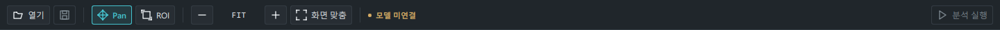
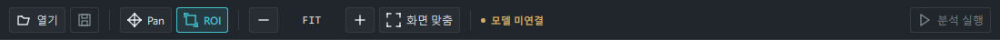

# 툴바 아이콘 정렬

공통 `AppButton`의 콘텐츠를 버튼 중앙에 배치했습니다. 아이콘만 있는 버튼은
16×16 아이콘을 중앙에 놓고, 글자가 있는 버튼은 아이콘과 글자 묶음을 중앙에
놓습니다. 좌우 여백은 8px, 아이콘과 글자 간격은 6px이며, 폭이 제한되면 글자를
생략 표시합니다. 설정창과 패널에서도 같은 버튼 배치를 사용합니다.

## 검증

- Windows의 실제 PySide6/Qt Quick Basic 화면에서 1440×900 및 1100×700 확인
- 빈 화면의 비활성 버튼, 데모의 Pan/ROI 선택 상태, 설정창 확인
- QML 경고 없음, 기존 테스트 80개 통과, Ruff 및 `git diff --check` 통과
- 캡처는 합성 데모와 임시 설정만 사용





[빈 화면](screenshots/toolbar/empty-1440.png),
[ROI 선택 상태](screenshots/toolbar/demo-roi-1440.png),
[설정창](screenshots/toolbar/settings-1100.png)

재현 방법 (저장소 루트, viewer 의존성이 설치된 환경):

```powershell
.venv\Scripts\python.exe tools/capture_toolbar.py
```

현재 검증은 Windows의 Qt 렌더링 기준입니다. 운영체제별 글꼴에 따라 글자 폭은
달라질 수 있으며, 아이콘과 글자 묶음은 계산된 폭을 기준으로 중앙에 배치됩니다.
